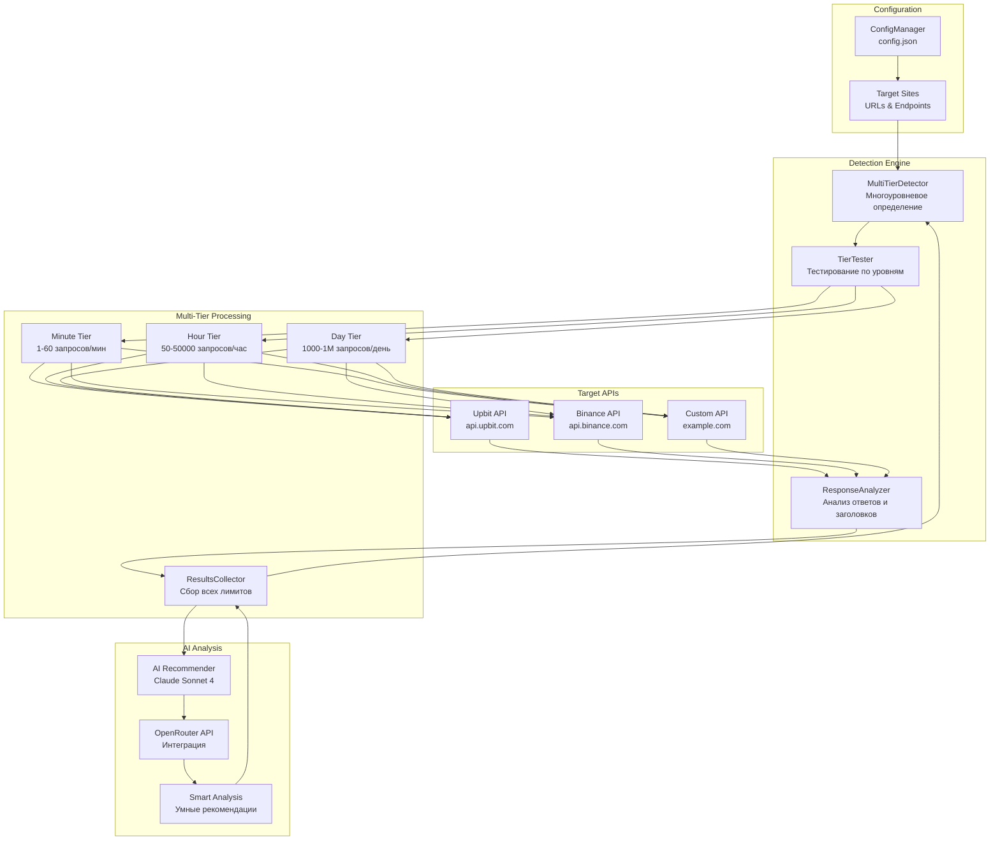
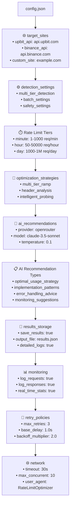
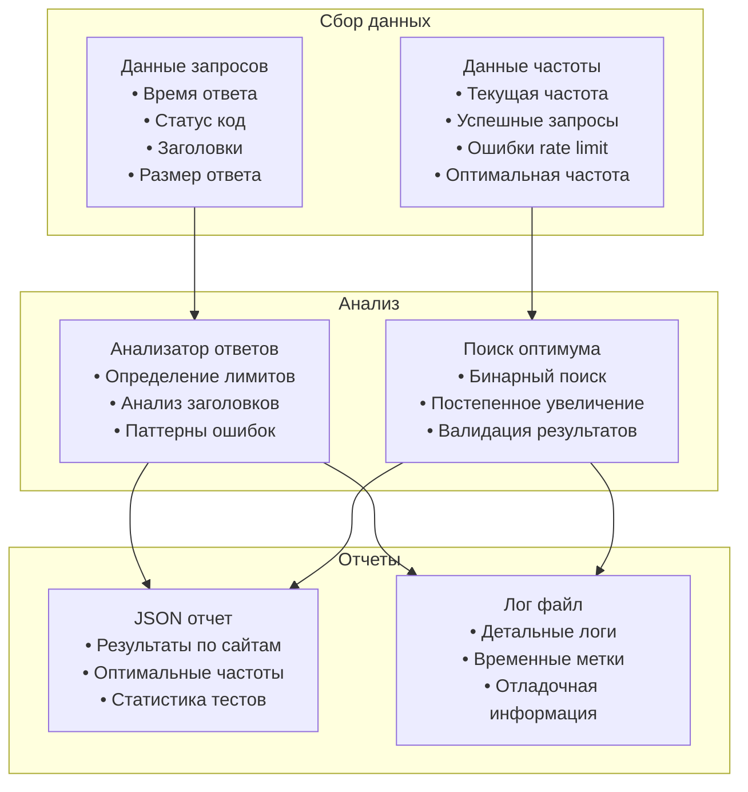
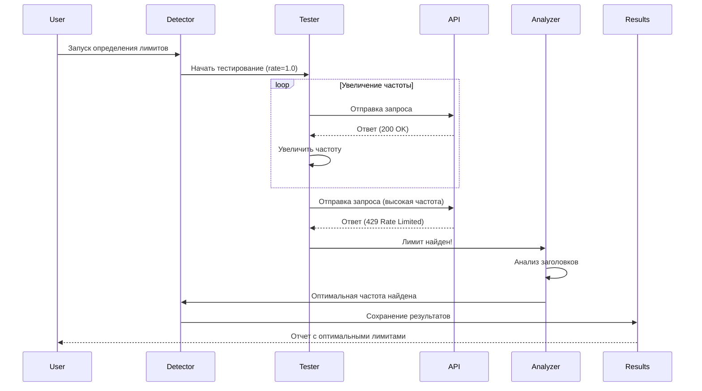

# 📊 Rate Limit Optimizer - Архитектура системы

## 🎯 Обзор системы
Система для автоматического определения многоуровневых rate limit'ов (минута/час/день) конкретного сайта/API путем умного тестирования и анализа заголовков.

## 🏗️ Архитектура компонентов



## 🔄 Алгоритм оптимизации

```mermaid
flowchart TD
    Start([Запуск системы]) --> LoadConfig[Загрузка config.json]
    LoadConfig --> ValidateConfig{Валидация<br/>конфигурации}
    ValidateConfig -->|Ошибка| ConfigError[Ошибка конфигурации]
    ValidateConfig -->|OK| SelectSite[Выбор целевого сайта]
    
    SelectSite --> CheckHeaders[Проверка заголовков<br/>X-RateLimit-*]
    CheckHeaders --> HeadersFound{Множественные<br/>заголовки найдены?}
    HeadersFound -->|Да| ExtractMultipleLimits[Извлечение всех лимитов<br/>Minute/Hour/Day]
    HeadersFound -->|Нет| StartTierTesting[Начать многоуровневое<br/>тестирование]
    
    ExtractMultipleLimits --> SelectTier[Выбор уровня для<br/>верификации]
    StartTierTesting --> SelectTier
    
    SelectTier --> TestMinute{Тестировать<br/>минутные лимиты?}
    TestMinute -->|Да| MinuteTesting[Тестирование 1-1000 req/min<br/>Длительность: 5 минут]
    TestMinute -->|Нет| TestHour{Тестировать<br/>часовые лимиты?}
    
    MinuteTesting --> MinuteResult{Лимит найден?}
    MinuteResult -->|Да| SaveMinuteLimit[Сохранить минутный лимит]
    MinuteResult -->|Нет| TestHour
    SaveMinuteLimit --> TestHour
    
    TestHour -->|Да| HourTesting[Тестирование 50-50000 req/hour<br/>Длительность: 90 минут]
    TestHour -->|Нет| TestDay{Тестировать<br/>дневные лимиты?}
    
    HourTesting --> HourResult{Лимит найден?}
    HourResult -->|Да| SaveHourLimit[Сохранить часовой лимит]
    HourResult -->|Нет| TestDay
    SaveHourLimit --> TestDay
    
    TestDay -->|Да| DayTesting[Тестирование 1000-1M req/day<br/>Длительность: 25 часов]
    TestDay -->|Нет| AnalyzeLimits[Анализ найденных лимитов]
    
    DayTesting --> DayResult{Лимит найден?}
    DayResult -->|Да| SaveDayLimit[Сохранить дневной лимит]
    DayResult -->|Нет| AnalyzeLimits
    SaveDayLimit --> AnalyzeLimits
    
    AnalyzeLimits --> DetermineMostRestrictive[Определение самого<br/>строгого лимита]
    DetermineMostRestrictive --> GenerateAIPrompt[Генерация промпта<br/>для AI анализа]
    GenerateAIPrompt --> CallOpenRouter[Вызов OpenRouter API<br/>Claude Sonnet 4]
    CallOpenRouter --> ParseAIResponse[Парсинг AI ответа<br/>и рекомендаций]
    ParseAIResponse --> OptimalFound[Все лимиты найдены<br/>+ AI рекомендации]
    
    OptimalFound --> SaveResults[Сохранение результатов<br/>с AI рекомендациями]
    SaveResults --> NextSite{Есть еще сайты?}
    NextSite -->|Да| SelectSite
    NextSite -->|Нет| GenerateReport[Генерация отчета]
    
    HandleError --> RetryRequest{Повторить?}
    RetryRequest -->|Да| SendRequest
    RetryRequest -->|Нет| NextSite
    
    NoLimitFound --> SaveResults
    ConfigError --> End([Завершение])
    GenerateReport --> End
```



## 📋 Структура config.json



## 🔧 Компоненты системы

### 1. ConfigManager
```python
class TargetSite(BaseModel):
    base_url: str = Field(..., regex=r'^https?://')
    endpoints: List[str] = Field(min_items=1)
    headers: Dict[str, str] = Field(default_factory=dict)
    auth: AuthConfig

class RateLimitTier(BaseModel):
    name: str = Field(..., regex=r'^(minute|15_minutes|hour|day)$')
    window_seconds: int = Field(gt=0)
    start_rate: int = Field(gt=0)
    max_rate: int = Field(gt=0)
    increment: int = Field(gt=0)
    test_duration_minutes: Optional[int] = None
    test_duration_hours: Optional[int] = None

class MultiTierDetection(BaseModel):
    enabled: bool = True
    test_all_tiers: bool = True
    tiers_to_test: List[RateLimitTier]

class DetectionSettings(BaseModel):
    multi_tier_detection: MultiTierDetection
    batch_settings: BatchSettings
    safety_settings: SafetySettings
    success_threshold: float = Field(ge=0, le=1, default=0.95)
    error_codes_to_detect: List[int] = Field(default=[429, 503, 502, 420])

class Config(BaseModel):
    target_sites: Dict[str, TargetSite]
    detection_settings: DetectionSettings
    optimization_strategies: Dict[str, OptimizationStrategy]
    results_storage: ResultsStorage
    monitoring: MonitoringConfig
    retry_policies: RetryConfig
    network: NetworkConfig
```

### 2. MultiTierDetector
```python
class MultiTierDetector:
    async def detect_all_rate_limits(
        self, 
        site: TargetSite,
        endpoint: str
    ) -> MultiTierResult:
        # Анализ заголовков для быстрого определения
        # Последовательное тестирование всех уровней
        # Определение самого строгого лимита
        # Возврат всех найденных лимитов
        
class MultiTierResult(BaseModel):
    minute_limit: Optional[RateLimit] = None
    hour_limit: Optional[RateLimit] = None  
    day_limit: Optional[RateLimit] = None
    most_restrictive: str
    recommended_rate: int
```

### 3. TierTester
```python
class TierTester:
    async def test_tier(
        self,
        url: str,
        tier: RateLimitTier
    ) -> TierTestResult:
        # Тестирование конкретного временного окна
        # Адаптивное увеличение частоты
        # Обнаружение лимита через 429 ошибки
        # Анализ заголовков для подтверждения
        # Возврат результатов с временными метками
        
    async def respect_existing_limits(
        self,
        existing_limits: List[RateLimit]
    ) -> None:
        # Учет уже найденных лимитов при тестировании
        # Избежание превышения более строгих лимитов
```

### 4. AIRecommender
```python
class AIRecommender:
    def __init__(self, openrouter_api_key: str):
        self.client = OpenRouterClient(api_key)
        self.model = "anthropic/claude-3.5-sonnet"
    
    async def generate_recommendations(
        self,
        test_results: MultiTierResult,
        api_context: APIContext
    ) -> AIRecommendations:
        # Формирование контекста для AI
        prompt = self._build_analysis_prompt(test_results, api_context)
        
        # Вызов Claude Sonnet 4 через OpenRouter
        response = await self.client.chat_completion(
            model=self.model,
            messages=[
                {"role": "system", "content": self.system_prompt},
                {"role": "user", "content": prompt}
            ],
            temperature=0.1,
            max_tokens=2000
        )
        
        # Парсинг и структурирование рекомендаций
        return self._parse_ai_response(response)
    
    def _build_analysis_prompt(
        self, 
        results: MultiTierResult, 
        context: APIContext
    ) -> str:
        return f"""
        Проанализируй результаты тестирования rate limits для API:
        
        API: {context.api_name} ({context.base_url})
        Обнаруженные лимиты:
        - Минутный: {results.minute_limit}
        - Часовой: {results.hour_limit}  
        - Дневной: {results.day_limit}
        
        Самый строгий лимит: {results.most_restrictive}
        Заголовки: {results.headers_found}
        Паттерны ошибок: {results.error_patterns}
        
        Дай практические рекомендации по:
        1. Оптимальной стратегии использования
        2. Паттернам реализации в коде
        3. Обработке ошибок
        4. Мониторингу
        5. Масштабированию
        """

class AIRecommendations(BaseModel):
    generated_by: str
    timestamp: datetime
    analysis: RecommendationAnalysis
    confidence_score: float = Field(ge=0, le=1)
    risk_assessment: str
    estimated_cost_impact: str
```

## 📊 Результаты и отчетность



## 🚀 Стратегии определения лимитов

### 1. Binary Search Strategy
- Быстрый поиск оптимальной частоты
- Логарithmическая сложность O(log n)
- Точность до заданного значения
- Минимальное количество тестовых запросов

### 2. Gradual Increase Strategy  
- Постепенное увеличение частоты запросов
- Безопасный подход для чувствительных API
- Автоматический откат при обнаружении лимита
- Подходит для консервативного тестирования

### 3. Header Analysis Strategy
- Анализ заголовков ответа (X-RateLimit-*)
- Извлечение информации о лимитах из API
- Быстрое определение без тестирования
- Работает только если API предоставляет заголовки

## 🔄 Процесс определения лимитов



## ✅ Ключевые особенности

### 🔒 Соответствие требованиям @docs.ai
- **Полная типизация**: Все компоненты используют Pydantic v2 модели
- **Async/await**: Неблокирующие операции для HTTP запросов
- **Error handling**: Структурированная обработка ошибок с контекстом
- **Performance**: Оптимизация для минимального количества тестовых запросов
- **Logging**: Детальное логирование процесса определения лимитов

### 🎯 Основная функциональность
- **Автоматическое определение**: Нахождение rate limit'ов без предварительных знаний
- **Множественные стратегии**: Binary search, gradual increase, header analysis
- **Поддержка различных API**: REST API с разными схемами аутентификации
- **Детальная отчетность**: JSON отчеты с результатами и статистикой
- **Гибкая конфигурация**: Настройка через config.json

### 🛡️ Безопасность тестирования
- **Постепенное увеличение**: Избежание резких скачков нагрузки
- **Retry policies**: Умные повторные попытки при временных сбоях
- **Timeout handling**: Обработка таймаутов и сетевых ошибок
- **Rate limiting detection**: Распознавание различных типов ограничений
- **Graceful handling**: Корректная обработка неожиданных ответов

## 📈 Ожидаемые результаты
- **Полное определение лимитов**: Нахождение всех уровней лимитов (минута/час/день)
- **Многоуровневое тестирование**: От 5 минут до 25 часов в зависимости от уровня
- **Определение самого строгого лимита**: Выявление лимитирующего фактора
- **Умное тестирование**: Учет уже найденных лимитов при тестировании следующих уровней
- **Детальная аналитика**: Статистика по каждому уровню с заголовками и временем сброса
- **Практические рекомендации**: Конкретная рекомендуемая частота запросов
